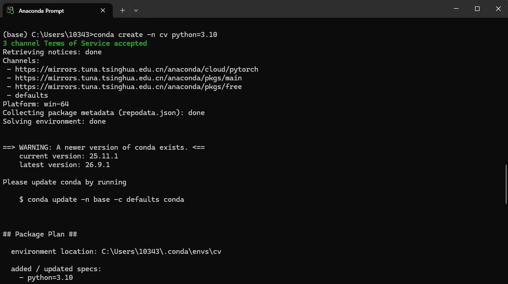
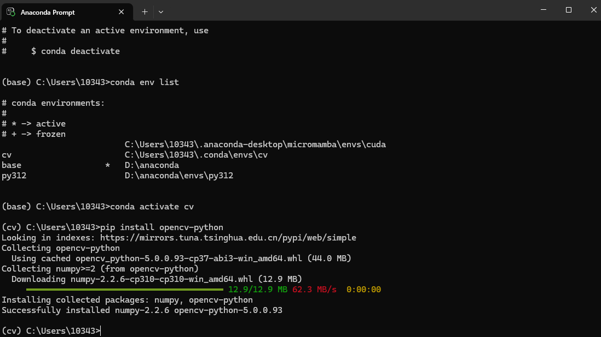
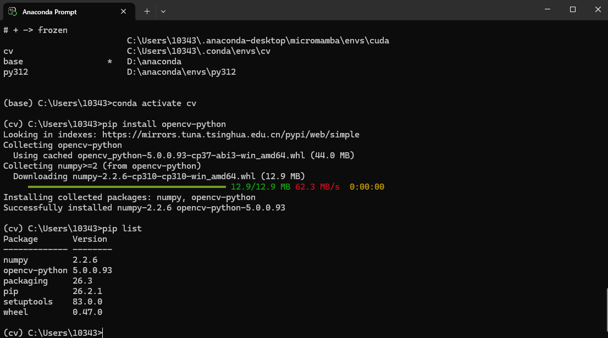
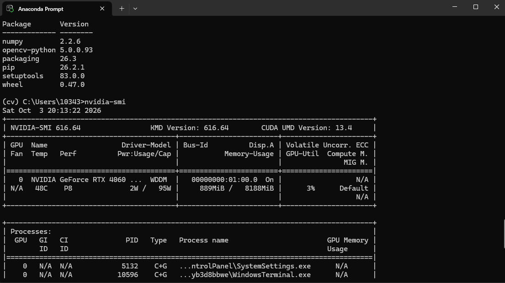
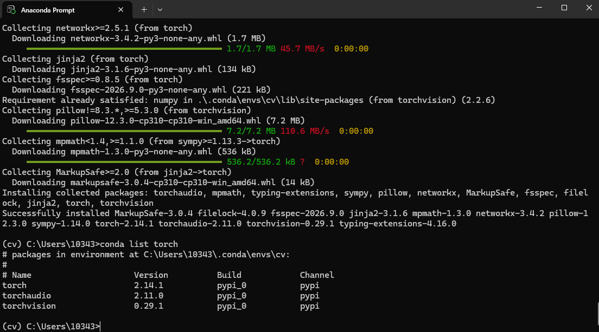
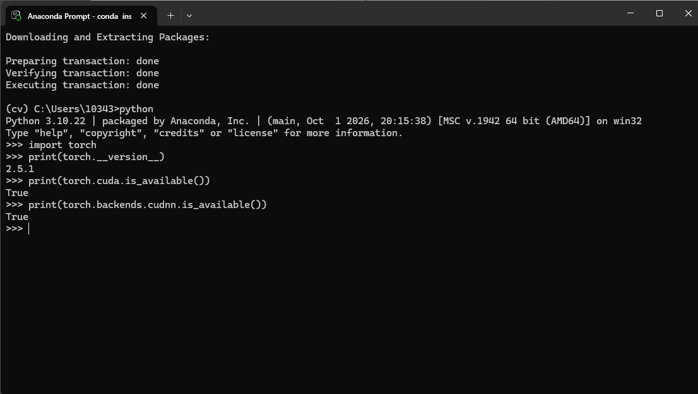

202410315004-荆爔恺，指导老师：胡政伟

# 实验一：计算机视觉库的安装

## 一、实验目的

掌握 Anaconda 的安装与基本操作，熟悉 GPU 使用环境的配置及对应版本 PyTorch 的安装，并完成 OpenCV 的安装与配置。

## 二、Anaconda 环境配置与 OpenCV 安装

通过 `conda --version` 查看当前 Anaconda 的版本，通过 `conda config --show` 查看 Anaconda 的配置信息，并创建名为 `cv` 的 Python 3.10 虚拟环境。

```bash
conda --version
conda config --show
conda create -n cv python=3.10
```



激活 `cv` 环境后安装 `opencv-python` 库。

```bash
conda activate cv
pip install opencv-python
```



安装完成后通过 `pip list` 查看已安装的包。

```bash
pip list
```



## 三、GPU 加速环境配置

通过 `nvidia-smi` 查看 NVIDIA 显卡驱动及 GPU 使用情况，通过 `nvcc --version` 查看本地 CUDA Toolkit 版本。若未安装本地 CUDA Toolkit，`nvcc` 命令会报错。

```bash
nvidia-smi
nvcc --version
```



## 四、PyTorch 安装

从 PyTorch 官网复制对应 CUDA 版本的 pip 安装命令，在 `cv` 虚拟环境中安装 PyTorch。安装完成后通过 `conda list torch` 查看已安装的 torch 相关包。

```bash
# 此处替换为你从 pytorch 官网复制得到的 pip 安装命令
conda list torch
```



## 五、PyTorch GPU 加速验证

在 Python 中导入 torch，通过 `torch.cuda.is_available()` 验证 CUDA 是否可用，通过 `torch.backends.cudnn.is_available()` 验证 cuDNN 是否可用。

```python
import torch
print(torch.__version__)
print(torch.cuda.is_available())
print(torch.backends.cudnn.is_available())
```



## 六、实验结果分析

本次实验在 `cv` 虚拟环境中顺利完成 OpenCV 与 PyTorch 的安装配置。`nvidia-smi` 正确识别到 RTX 4060 显卡，`torch.cuda.is_available()` 与 `torch.backends.cudnn.is_available()` 均返回 True，表明 CUDA 与 cuDNN 的 GPU 加速均已生效，实验环境搭建成功，可满足后续计算机视觉实验中深度学习模型训练的需求。

## 七、实验总结

本次实验主要完成计算机视觉实验环境搭建，为后续 CV 实验做准备。

- 熟悉 Anaconda 虚拟环境创建、激活、查看包等基础操作。
- 完成 OpenCV、PyTorch 库安装，验证 GPU 加速是否可用。
- 通过 `torch.cuda.is_available()` 确认 CUDA 加速可用，`torch.backends.cudnn.is_available()` 确认 cuDNN 可用，为后续深度学习模型训练提供 GPU 加速支持。
